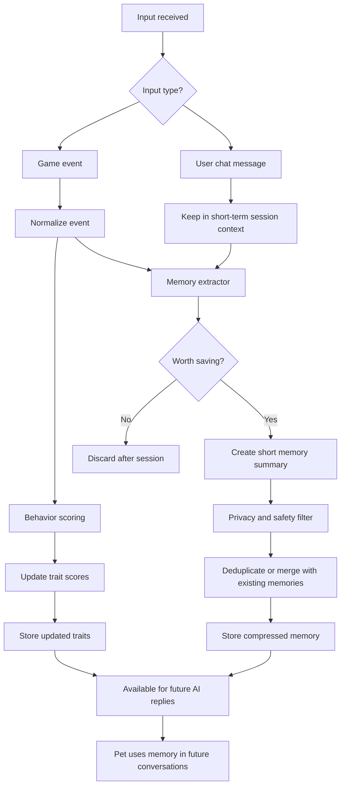
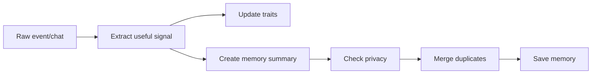
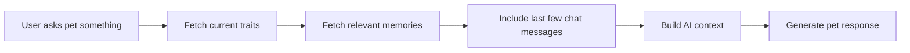

# AI Memory Design

## Overview

The AI pet should not store the full chat history as long-term memory. Full transcripts become too large, noisy, and may contain sensitive or unimportant details.

Instead, the system should use compressed memory:

1. Keep only the last few chat messages temporarily for short-term context.
2. Store structured game events because they are already small and useful.
3. Convert important events and conversations into short memory summaries.
4. Track long-term player behavior with trait scores.
5. Merge duplicate memories instead of creating repeated entries.

## Memory Layers

| Memory Type | What It Stores | Example | Storage Rule |
|---|---|---|---|
| Recent Context | Last 5-10 chat messages in the current session | User asks how they are playing | Temporary only |
| Long-Term Memories | Short summaries of important behavior or preferences | "Player often rushes alone in Free Fire." | Save to database |
| Trait Scores | Numeric profile of player behavior | teamwork: 42, aggression: 78 | Save to database |
| Event Timeline | Important game actions | `rushed_alone`, `revived_teammate` | Save structured events |
| Session Summary | Optional summary of a conversation session | "Player asked for feedback on teamwork." | Optional for MVP |

## What To Store

| Store This | Do Not Store This |
|---|---|
| Short memory summaries | Full chat history |
| Structured game events | Every single message |
| Trait scores | Random small talk |
| Important player preferences | Sensitive personal details |
| Repeated behavior patterns | One-off assumptions |
| Major relationship changes | Low-confidence guesses |

## Recommended Memory Processing Flow



## Memory Write Flow



## Memory Read Flow



## When To Summarize

Summarize before saving to long-term memory.

For chat messages, do not save the whole conversation by default. Keep the last 5-10 messages in short-term memory for the active session, then run a memory extractor to decide whether anything is worth saving.

For game events, save the raw structured event first because it is compact and useful for audit/debugging. Then create a summarized memory only if the event is meaningful.

| Input Type | Save Raw First? | Summarize Before Long-Term DB? | Reason |
|---|---:|---:|---|
| Game event | Yes | Yes | Events are already small and structured |
| User chat | No, keep temporary only | Yes | Full chat gets long and may contain sensitive/random content |
| Important user preference | No full chat | Yes | Store the preference, not the conversation |
| Behavior pattern | Store event evidence | Yes | Memory should be compressed and reusable |

## When To Merge Duplicates

Merge duplicates after summarizing.

Duplicate detection works better on clean memory summaries than on messy raw chat or raw events.

Recommended order:

1. Receive input.
2. Convert it into a memory candidate.
3. Summarize the candidate.
4. Apply privacy and quality filters.
5. Compare against existing memories.
6. Merge with an existing memory or insert a new one.

Example new event:

```json
{
  "game": "Free Fire",
  "event": "rushed_alone",
  "match_id": "match_123"
}
```

Generated memory candidate:

```text
Player rushed alone instead of staying with teammates in Free Fire.
```

Existing memory:

```text
Player tends to rush ahead alone during team fights.
```

Merged memory:

```json
{
  "summary": "Player often rushes ahead alone during team fights, especially in Free Fire.",
  "importance": 0.82,
  "confidence": 0.88,
  "times_observed": 4,
  "last_seen_at": "2026-08-08"
}
```

## Example Stored Memory

```json
{
  "user_id": "player_001",
  "type": "behavior",
  "game": "Free Fire",
  "summary": "Player tends to rush ahead alone during team fights.",
  "traits_affected": ["teamwork", "aggression", "risk_taking"],
  "importance": 0.75,
  "confidence": 0.82,
  "created_at": "2026-08-08",
  "last_used_at": null
}
```

## MVP Database Tables

| Table | Purpose |
|---|---|
| `users` | Stores player identity |
| `game_events` | Stores structured game events |
| `traits` | Stores long-term behavior scores |
| `memories` | Stores compressed AI-readable memories |
| `conversation_sessions` | Optionally stores session-level summaries |
| `friend_suggestions` | Stores suggested teammates |

## Suggested Memories Table

```sql
CREATE TABLE memories (
  id UUID PRIMARY KEY,
  user_id TEXT NOT NULL,
  type TEXT NOT NULL,
  game TEXT,
  summary TEXT NOT NULL,
  traits_affected JSONB,
  importance FLOAT NOT NULL DEFAULT 0.5,
  confidence FLOAT NOT NULL DEFAULT 0.5,
  times_observed INTEGER NOT NULL DEFAULT 1,
  created_at TIMESTAMP NOT NULL,
  updated_at TIMESTAMP NOT NULL,
  last_seen_at TIMESTAMP,
  last_used_at TIMESTAMP
);
```

## Optional Future Improvement

For smarter memory recall, add vector search with `pgvector`:

```sql
ALTER TABLE memories ADD COLUMN embedding VECTOR;
```

This allows the AI to retrieve memories by meaning instead of only by keyword.

## AI Response Context

When the user talks to the pet, the backend should build a compact context package:

```text
Player traits:
- aggression: high
- teamwork: low
- risk-taking: high

Relevant memories:
- Player rushed alone in Free Fire and ignored teammate positioning.
- Player performed well mechanically but caused team coordination issues.

Recent chat:
- User asked: "How am I playing?"
```

The AI then uses this context to produce a natural response.

Example response:

```text
You've been playing aggressively and rushing ahead. It works sometimes, but your team may struggle to keep up.
```

## MVP Recommendation

For the 1-week MVP:

1. Save raw structured game events.
2. Do not save full chat history.
3. Keep only the last 5-10 chat messages temporarily.
4. Save only summarized long-term memories.
5. Merge duplicates during memory write.
6. Store trait scores separately from memory text.
7. Add background cleanup later if duplicate memories are missed during live processing.
