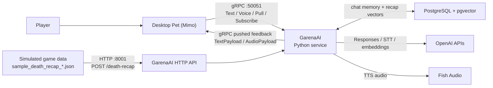

# GarenaHack

GarenaHack is a hackathon prototype centered on **Mimo**, a floating desktop pet that chats with the player, listens to voice input, speaks responses with Fish Audio TTS, remembers conversations by player ID, and can react to simulated game death-recap data.

This root README is the project overview. Component-specific setup lives in:

- [GarenaAI/README.md](GarenaAI/README.md) for the Python AI, gRPC, HTTP, Postgres, OpenAI, and Fish Audio service.
- [DesktopPet/README.md](DesktopPet/README.md) for the Qt/QML desktop pet build and usage.
- [GarenaPortal/README.md](GarenaPortal/README.md) for the React/Vite portal prototype.

## Product Design

The active demo is a desktop companion flow:

- Mimo runs as an always-on-top desktop pet.
- Players can chat by text or voice.
- Each player logs in with a `player_id` in the pet settings, so chat memory is separated by player.
- GarenaAI stores conversation history and rolling summaries in Postgres.
- Fish Audio turns assistant replies and death-recap feedback into playable audio.
- Simulated game data is posted separately as death-recap JSON. The desktop pet does not generate game telemetry.
- Generated death-recap feedback is pushed back to Mimo through the same gRPC receive stream used for backend-pushed messages.

## Architecture



Runtime ports:

- `127.0.0.1:50051`: GarenaAI gRPC server for DesktopPet.
- `127.0.0.1:8001`: GarenaAI HTTP server for simulated death-recap JSON.

## Technical Implementation

### Design Decisions

- The active demo is centered on the desktop pet and GarenaAI service. `GarenaPortal` and `GarenaBackend` are kept in the repository, but they are not required for the main Mimo demo.
- DesktopPet is conversation-only. It does not generate gameplay telemetry or hidden game stats.
- Simulated game data enters through GarenaAI's HTTP endpoint as sample death-recap JSON.
- `player_id` is the user-facing identity boundary. DesktopPet lets each tester set a unique player ID, and GarenaAI stores chat memory under that ID.
- Fish Audio TTS is optional. Text responses still work when TTS is disabled or unavailable.
- Fish TTS requests are clamped to 500 characters before calling Fish Audio.
- The Fish TTS speaker voice is pinned with `FISH_TTS_REFERENCE_ID` so Mimo does not change voice between runs.
- Desktop unary gRPC requests use the timeout defined in `DesktopPet/CMakeLists.txt`:

```cmake
set(GARENA_PET_GRPC_TIMEOUT_SECONDS 120)
```

### gRPC Contract

The shared protobuf contract lives at [DesktopPet/proto/garena_pet.proto](DesktopPet/proto/garena_pet.proto).

```proto
service GarenaPetService {
  rpc SendText(TextRequest) returns (PetResponse);
  rpc SendVoice(VoiceRequest) returns (stream PetResponse);
  rpc PullMessages(PullMessagesRequest) returns (MessageBatch);
  rpc SubscribeMessages(SubscribeRequest) returns (stream PetServerMessage);
}
```

Implementation behavior:

- `SendText` sends one player text message and receives one `PetResponse`.
- `SendVoice` sends one completed WAV and streams responses. GarenaAI sends a transcript-only response first, then the final assistant response.
- `PullMessages` fetches pending backend-pushed messages for a player.
- `SubscribeMessages` opens the receive stream used for backend-pushed messages such as death-recap feedback.
- `PetResponse` and `PetServerMessage` can carry text-only replies or `AudioPayload` bytes with MIME types such as `audio/wav` or `audio/mpeg`.

### Text And Voice Flow

Text flow:

1. DesktopPet sends `TextRequest(player_id, message)` over gRPC.
2. GarenaAI loads the latest rolling summary plus recent unsummarized chat rows for that player.
3. GarenaAI calls OpenAI for the assistant response.
4. GarenaAI saves the user and assistant turns to Postgres when memory is enabled.
5. GarenaAI optionally generates Fish TTS audio and returns the response to DesktopPet.

Voice flow:

1. DesktopPet records a completed WAV with push-to-talk or voice activity mode.
2. DesktopPet sends `VoiceRequest(player_id, wav_audio, duration_ms, mode)`.
3. GarenaAI normalizes readable WAVs to `16 kHz`, `16-bit`, mono for transcription.
4. GarenaAI transcribes with OpenAI STT and immediately streams the transcript to DesktopPet.
5. GarenaAI generates the final assistant reply using the same memory flow as text.
6. GarenaAI returns text plus optional Fish TTS audio.

### Conversation Memory

GarenaAI stores conversation memory in Postgres with psycopg3.

Tables initialized by [GarenaAI/initializedb.sql](GarenaAI/initializedb.sql):

- `ai_users`: one row per desktop `player_id`, stored as `display_name`.
- `ai_chat_messages`: raw user and assistant turns with role, source, request ID, and `summarized_at`.
- `ai_chat_summaries`: append-only rolling conversation summaries.
- `game`: game lookup table for simulated recap storage.
- `user_game_data`: raw death-recap JSON plus embedding vectors for similarity search.

Memory implementation details:

- Incoming gRPC `player_id` maps to `ai_users.display_name`.
- `ai_users.user_id` is the internal UUID primary key used by chat and summary tables.
- Recent unsummarized chat rows are included in prompts up to `GARENA_MEMORY_MAX_CHAT_MESSAGES`.
- When unsummarized rows reach `GARENA_MEMORY_SUMMARIZE_EVERY_MESSAGES`, GarenaAI asks OpenAI to fold them into a new summary row.
- Summarized chat rows are kept for debugging and marked with `summarized_at`; they are not deleted.
- Postgres connections are tracked and closed during normal shutdown and `KeyboardInterrupt` cleanup.

### Simulated Death Recap Flow

The sample files [GarenaAI/sample_death_recap.json](GarenaAI/sample_death_recap.json) and [GarenaAI/sample_death_recap_2.json](GarenaAI/sample_death_recap_2.json) simulate game telemetry.

`POST /death-recap` behavior:

1. FastAPI receives `user_id`, `game_id`, and event JSON.
2. `GameEventRepository.summarize_events(...)` turns the event list into text.
3. GarenaAI embeds the summary with OpenAI embeddings.
4. GarenaAI searches `user_game_data` for similar recap vectors using pgvector cosine distance.
5. GarenaAI generates feedback with OpenAI.
6. GarenaAI saves the raw recap and embedding.
7. GarenaAI publishes feedback through the gRPC receive stream.
8. If TTS is enabled, the pushed message includes Fish Audio bytes so Mimo speaks the feedback.

### DesktopPet Implementation Details

- Qt/QML renders the floating Mimo window, chat window, settings window, and pet sprite.
- C++ owns gRPC transport, microphone capture, media playback, and QML-facing backend state.
- `BackendClient` exposes backend status, player login, send/pull/stream actions, fallback replies, and audio playback to QML.
- `PetGrpcClient` runs blocking gRPC work on background threads so the UI remains responsive.
- The settings window persists `player_id` locally with `QSettings`.
- Switching player IDs reconnects the backend receive stream and clears the visible chat so sessions do not appear mixed.
- On macOS, the executable embeds `NSMicrophoneUsageDescription` through the CMake plist/linker setup so Qt can request microphone permission.

### Audio Implementation Details

- DesktopPet sends completed WAV bytes to GarenaAI.
- GarenaAI saves incoming WAVs only when `GARENA_PET_SAVE_WAV=1`.
- Fish TTS output format is controlled by `FISH_TTS_FORMAT`; the current demo config uses WAV.
- Generated TTS debug files are saved only when `GARENA_PET_SAVE_TTS_WAV=1`.
- DesktopPet resets the media source for every audio reply so each new assistant response plays instead of replaying stale audio.

### Implementation File Map

GarenaAI:

- [GarenaAI/main.py](GarenaAI/main.py): starts the gRPC server and HTTP server, then closes services and database connections during shutdown.
- [GarenaAI/pet_grpc_service.py](GarenaAI/pet_grpc_service.py): implements `SendText`, `SendVoice`, `PullMessages`, and `SubscribeMessages`.
- [GarenaAI/http_api.py](GarenaAI/http_api.py): exposes `POST /death-recap` and publishes generated feedback to the desktop message hub.
- [GarenaAI/ai_engine.py](GarenaAI/ai_engine.py): builds prompts, calls OpenAI for assistant replies, and summarizes chat memory.
- [GarenaAI/audio_services.py](GarenaAI/audio_services.py): handles OpenAI STT, Fish TTS, 500-character TTS clamping, voice pinning, and MIME type selection.
- [GarenaAI/memory_repository.py](GarenaAI/memory_repository.py): owns reusable Postgres session logic for chat memory and summaries.
- [GarenaAI/game_event_repository.py](GarenaAI/game_event_repository.py): summarizes game-event JSON, performs pgvector similarity search, and saves death recaps.
- [GarenaAI/db.py](GarenaAI/db.py): builds psycopg connections and tracks open connections for graceful cleanup.
- [GarenaAI/initializedb.sql](GarenaAI/initializedb.sql): initializes the active Postgres schema.
- [GarenaAI/.config](GarenaAI/.config): stores non-secret runtime settings.

DesktopPet:

- [DesktopPet/CMakeLists.txt](DesktopPet/CMakeLists.txt): configures Qt, local gRPC/protobuf, generated proto code, macOS microphone plist, and the desktop gRPC timeout.
- [DesktopPet/proto/garena_pet.proto](DesktopPet/proto/garena_pet.proto): defines the shared gRPC API.
- [DesktopPet/src/petgrpcclient.cpp](DesktopPet/src/petgrpcclient.cpp): C++ gRPC transport, deadlines, background request threads, and receive stream handling.
- [DesktopPet/src/backendclient.cpp](DesktopPet/src/backendclient.cpp): QML-facing backend wrapper, player login persistence, fallback replies, stream reconnects, and audio playback.
- [DesktopPet/src/voicerecorder.cpp](DesktopPet/src/voicerecorder.cpp): microphone capture, push-to-talk, voice activity mode, and WAV creation.
- [DesktopPet/qml/Main.qml](DesktopPet/qml/Main.qml): main pet window, chat model, message wiring, and automatic receive-stream connection.
- [DesktopPet/qml/components/SettingsWindow.qml](DesktopPet/qml/components/SettingsWindow.qml): player login, backend target, stream controls, and voice settings.
- [DesktopPet/qml/components/ChatWindow.qml](DesktopPet/qml/components/ChatWindow.qml): chat UI and voice controls.

## Repository Components

### GarenaAI

[GarenaAI](GarenaAI/) is the active Python backend.

Responsibilities:

- Implements the desktop pet gRPC contract.
- Starts the HTTP `/death-recap` endpoint.
- Calls OpenAI for chat responses, speech-to-text, summaries, and embeddings.
- Calls Fish Audio for TTS.
- Stores chat memory, summaries, and death-recap vectors in Postgres.
- Pushes death-recap feedback back to the desktop pet.

Start here for backend setup: [GarenaAI/README.md](GarenaAI/README.md).

### DesktopPet

[DesktopPet](DesktopPet/) is the active Qt/QML C++ desktop app.

Responsibilities:

- Renders the floating Mimo desktop pet.
- Provides chat and settings windows.
- Captures push-to-talk and voice-activity WAV audio.
- Sends text and voice over gRPC.
- Plays `AudioPayload` replies.
- Lets users set a unique player ID in settings.

Start here for desktop setup: [DesktopPet/README.md](DesktopPet/README.md).

### GarenaPortal

[GarenaPortal](GarenaPortal/) is a React/Vite portal prototype. It is separate from the active Mimo desktop demo.

Useful commands:

```bash
cd GarenaPortal
npm install
npm run dev
```

### GarenaBackend

[GarenaBackend](GarenaBackend/) is an older minimal FastAPI backend with a root health route and `/health/db`. It is not the active AI service used by the desktop pet demo.

Useful commands:

```bash
cd GarenaBackend
python -m venv .venv
source .venv/bin/activate
python -m pip install -r requirements.txt
uvicorn main:app --reload
```

## Environment Expectations

### GarenaAI secrets

Create `GarenaAI/.env` for secrets only:

```text
OPENAI_API_KEY=...
FISH_AUDIO_API_KEY=...
GARENA_DB_PASSWORD=...
```

### GarenaAI runtime config

`GarenaAI/.config` stores non-secret settings. Important groups:

- OpenAI models: `OPENAI_RESPONSE_MODEL`, `OPENAI_TRANSCRIBE_MODEL`, `OPENAI_EMBEDDING_MODEL`.
- gRPC and HTTP behavior: `GARENA_PET_GRPC_TTS`, `GARENA_PET_GRPC_HEARTBEAT_SECONDS`, `GARENA_DEATH_RECAP_PUSH_PLAYER_ID`.
- Postgres connection: `GARENA_DB_HOST`, `GARENA_DB_PORT`, `GARENA_DB_NAME`, `GARENA_DB_USER`, `GARENA_DB_SSLMODE`.
- Memory controls: `GARENA_MEMORY_ENABLED`, `GARENA_MEMORY_SAVE_CHAT_HISTORY`, `GARENA_MEMORY_MAX_CHAT_MESSAGES`.
- Fish Audio TTS: `FISH_TTS_BACKEND`, `FISH_TTS_REFERENCE_ID`, `FISH_TTS_FORMAT`, `FISH_TTS_TEMPERATURE`, `FISH_TTS_TOP_P`.

Environment variables override `.config`.

### DesktopPet environment

DesktopPet defaults to the local gRPC target:

```text
127.0.0.1:50051
```

Override it when launching:

```bash
GARENA_PET_GRPC_TARGET=127.0.0.1:50051 ./DesktopPet/bin/GarenaPet
```

DesktopPet waits up to the unary gRPC timeout set in `DesktopPet/CMakeLists.txt`. The project currently sets it to 120 seconds so slower Fish TTS responses can complete. To change it, edit `set(GARENA_PET_GRPC_TIMEOUT_SECONDS 120)` in the desktop CMake file and rebuild.

### Portal and legacy backend env files

- `GarenaPortal/.env.example` documents `VITE_API_URL`.
- `GarenaBackend/.env.example` documents legacy Postgres settings.

## Local Requirements

### Python backend

- Python 3.11+.
- Postgres with `pgcrypto` and `pgvector` extensions available.
- Network access to OpenAI and Fish Audio APIs at runtime.

### Desktop pet

- CMake 3.21+.
- Ninja or another CMake generator.
- C++23-capable compiler.
  - macOS: Xcode Command Line Tools / Apple Clang.
  - Windows: MSVC 2022 or a supported MinGW toolchain.
- Qt 6.5+ with:
  - Qt Quick
  - Qt Quick Controls 2
  - Qt Multimedia
- Local C++ gRPC and protobuf install under `DesktopPet/grpc`.

The desktop CMake file expects the local gRPC/protobuf package here:

```text
DesktopPet/grpc/lib/cmake/grpc/gRPCConfig.cmake
DesktopPet/grpc/lib/cmake/protobuf/...
DesktopPet/grpc/bin/grpc_cpp_plugin
DesktopPet/grpc/include/...
```

If `DesktopPet/grpc` is missing, install or copy a C++ gRPC/protobuf build into that folder before configuring the desktop app. Qt must also be installed locally; on macOS with Homebrew:

```bash
brew install qt cmake ninja
```

## Build Steps

### 1. Build and configure GarenaAI

From the repo root:

```bash
cd GarenaAI
python -m venv .venv
source .venv/bin/activate
python -m pip install -r requirements.txt
```

Create `GarenaAI/.env`, review `GarenaAI/.config`, then initialize the database once:

```bash
# From the repo root:
GarenaAI/.venv/bin/python -m GarenaAI.initialize_db
```

More detail: [GarenaAI/README.md](GarenaAI/README.md).

### 2. Build DesktopPet

With Qt installed through Homebrew:

```bash
cd DesktopPet
cmake -S . -B build -G Ninja \
  -DQt6_DIR="$(brew --prefix qt)/lib/cmake/Qt6"
cmake --build build
```

If Qt came from the Qt installer, replace `Qt6_DIR` with your local Qt kit path, for example:

```bash
cmake -S . -B build -G Ninja \
  -DQt6_DIR="$HOME/Qt/6.7.2/macos/lib/cmake/Qt6"
cmake --build build
```

The built app is:

```text
DesktopPet/bin/GarenaPet
```

More detail: [DesktopPet/README.md](DesktopPet/README.md).

### 3. Optional portal build

```bash
cd GarenaPortal
npm install
npm run build
```

## Launch Order For The Demo

### 1. Start GarenaAI

From the repo root:

```bash
cd GarenaAI
source .venv/bin/activate
python main.py
```

This starts:

- gRPC on `127.0.0.1:50051`.
- HTTP on `127.0.0.1:8001`.

### 2. Start DesktopPet

In another terminal:

```bash
# From the repo root:
GARENA_PET_GRPC_TARGET=127.0.0.1:50051 ./DesktopPet/bin/GarenaPet
```

Open Mimo settings and log in with a unique player ID before chatting. That ID is the backend memory key.

### 3. Send simulated game data

With GarenaAI and DesktopPet running, post one of the sample death-recap payloads:

```bash
cd GarenaAI
curl -X POST http://127.0.0.1:8001/death-recap \
  -H "Content-Type: application/json" \
  -d "@sample_death_recap_2.json"
```

GarenaAI will:

1. Summarize the JSON events.
2. Embed the summary.
3. Look up similar death recaps in Postgres with pgvector.
4. Generate feedback with OpenAI.
5. Save the recap.
6. Push the feedback to Mimo over gRPC.
7. Include Fish Audio TTS when `GARENA_PET_GRPC_TTS=1`.

For local demos, `GARENA_DEATH_RECAP_PUSH_PLAYER_ID` defaults to `demo-player`, so the pushed feedback reaches the default desktop pet even when the sample JSON uses a different `user_id`. If you log in as a different player, either set `GARENA_DEATH_RECAP_PUSH_PLAYER_ID` to that player ID or make the JSON `user_id` match.

## Common Checks

Test Postgres connectivity:

```bash
# From the repo root:
GarenaAI/.venv/bin/python -m GarenaAI.test_db_connection
```

Rebuild the desktop app:

```bash
cmake --build DesktopPet/build
```

Check the HTTP endpoint manually:

```bash
curl http://127.0.0.1:8001/docs
```

## Notes For Contributors

- Keep secrets out of `.config`; use `.env`.
- Do not reset or destroy the shared Postgres database unless the team agrees to lose demo memory.
- The desktop pet is not the source of game telemetry. Simulated game events enter through `POST /death-recap`.
- Use the component READMEs for deeper setup details before changing each subsystem.
